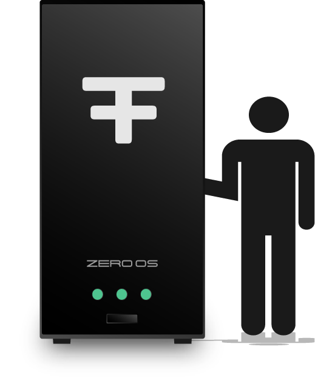

<!-- section 1 (step 1) -->



|||

## THE FOUNDATION {#h1}
## **BEGINS WITH YOU** {#h1}

 

 

FreeFlow Nodes can generate compute, storage and network capacity for your entire country. People deploy FreeFlow Nodes in homes, offices, schools, telco infrastructure or datacenters and generate income. 

 

Our unique operating system interconnects these nodes to create the FreeFlow Grid, your own sovereign and decentralized Internet. 



<!-- section 2 (step 2) -->



## EXPERIENCES {#text-6xl}
## **ARE BUILT** {#text-6xl}

 

Numerous applications and programs are immediately available to users of the FreeFlow Grid. Each application is decentralized and allows users a fully private and secure experience. 

 

<button>[SEE EXPERIENCES]("/experiences")</button>

|||



<!-- section 3 (step 3) -->



|||

## YOUR TWIN GIVES {#text-6xl}
## **COMPLETE ACCESS** {#text-6xl}

 

The FreeFlow Twin allows users to access the applications and programs on the FreeFlow Grid. 

 

By eliminating the need for centralized servers, the FreeFlow Twin allows you, the user, to be the only central point of data accumulation, making YOU the server. 

<button>[KNOW MORE]("/twin")</button>



<!-- section 4 (step 4) -->



## UNLOCK IT WITH {#text-6xl}
## **FREEFLOW KEY** {#text-6xl}

 

The FreeFlow Key is your digital identity. Created as an NFT, this identity provides an unprecedented level of security never before seen in the industry.

|||

