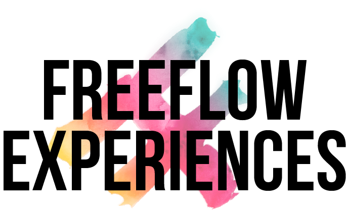

<!-- section 1 (header) -->



#### Unlimited access to decentralized alternatives to the world's most popular applications. Stay safe, secure and green with experiences built especially for FreeFlow users. 





<button class="experience-btn" onclick="window.location.href='quantum';">

### QUANTUM {#xp-heading}
#### DECENTRALIZED FILE MANAGER {#xp-heading}

The decentralized alternative to file storage programs such as Dropbox and Google Drive.

</button>

|||

<button class="experience-btn" onclick="window.location.href='whisper';">

### WHISPER {#xp-heading}
#### DECENTRALIZED CHATTING {#xp-heading}

The decentralized alternative to chatting apps like WhatsApp and Telegram.  Offers full encryption and true privacy.

</button>

|||

<button class="experience-btn" onclick="window.location.href='kutana';">

### KUTANA {#xp-heading}
#### DECENTRALIZED MEETINGS {#xp-heading}

The perfect alternative to video conferencing tools like Meet and Zoom with all the benefits of decentralization.

</button>





<button class="experience-btn" onclick="window.location.href='glass';">

### GLASS {#xp-heading}
#### DECENTRALIZED BROWSING {#xp-heading}

Forget all other browsers and experience the meaning of true anonymous browsing by using the decentralized Glass Browser.

</button>

|||

<button class="experience-btn" onclick="window.location.href='river';">

### RIVER {#xp-heading}
#### DECENTRALIZED SOCIAL MEDIA {#xp-heading}

Unlike other social media platforms, River allows you to own every bit of your data including every uploaded photo or video.

</button>

|||

<button class="experience-btn" onclick="window.location.href='wallet';">

### FREEFLOW WALLET {#xp-heading}
#### DECENTRALIZED WALLET {#xp-heading}

The most secure, decentralized wallet on the planet is now available free to all FreeFlow users.

</button>





<button class="experience-btn" onclick="window.location.href='coming-soon';">

### FREEFLOW TUBE {#xp-heading}
#### VIDEO BROWSING {#xp-heading}

The perfect decentralized alternative to video platforms where all uploaded videos belong to the creator and creator only.

</button>

|||

<button class="experience-btn" onclick="window.location.href='coming-soon';">

### FREEFLOW PUBLISHER {#xp-heading}
#### DECENTRALIZED WEB BUILDER {#xp-heading}

Build decentralized websites with easy-to-use tools created specifically for FreeFlow users.

</button>

|||

<button class="experience-btn" onclick="window.location.href='coming-soon';">

### FREEFLOW DEVELOPER {#xp-heading}
#### DECENTRALIZED DEV TOOLS {#xp-heading}

Develop applications to host on the the decentralized FreeFlow Grid and showcase them to the entire ecosystem.

</button>





<button class="experience-btn" onclick="window.location.href='coming-soon';">

### FREEFLOW ROOMS {#xp-heading}
#### DECENTRALIZED FORUMS {#xp-heading}

Discussion forums where prying eyes are no longer a concern are exclusively available to FreeFlow users.

</button>

|||

<button class="experience-btn" onclick="window.location.href='ourverse';">

### OURVERSE {#xp-heading}
#### DECENTRALIZED METAVERSE {#xp-heading}

Better, faster, safer and more diverse, the OurVerse metaverse is FreeFlow’s answer to the latest hype.

</button>

|||

<button class="experience-btn" onclick="window.location.href='sikana';">

### SIKANA {#xp-heading}
#### DECENTRALIZED VIDEO ED {#xp-heading}

Watch and learn from thousands of videos built specifically to empower those most in need.

</button>





<button class="experience-btn" onclick="window.location.href='coming-soon';">

### SHARE IT {#xp-heading}
#### DECENTRALIZED SHARING TOOLS {#xp-heading}

Share small and large files via the wordl’s first decentralized file sharing service without worrying about data loss.

</button>

|||

<button class="experience-btn" onclick="window.location.href='coming-soon';">

### MANY MORE {#xp-heading}
#### APPLICATIONS TO COME {#xp-heading}

More and more experiences are being conceptualized, designed and produced for FreeFlow users. Stay tuned!

</button>

|||


