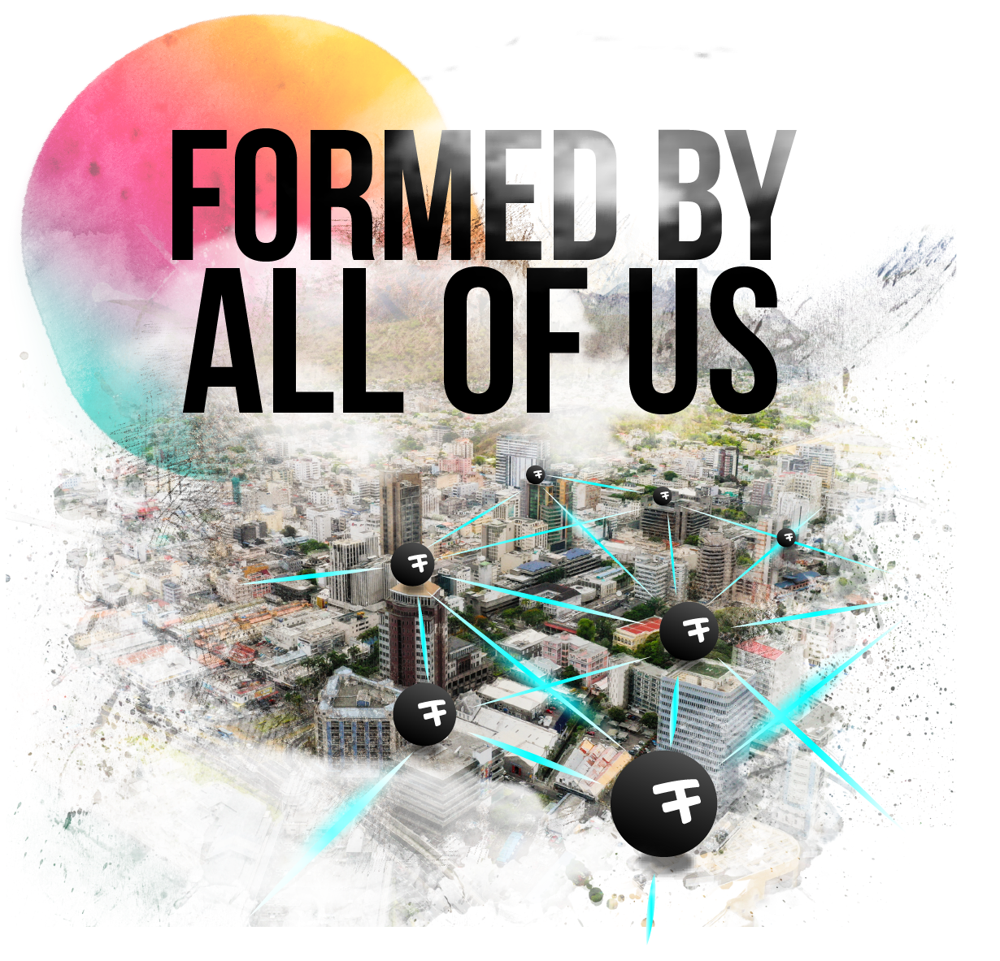

<!-- section 1 (header) -->



 

 

 

FreeFlow is the new internet, where you own your data, and security and privacy is just not an issue.  Formed by people just like you, the FreeFlow movement is now truly global.

<button>[TAKE PART]("/take-part")</button>



<!-- section 2 (FF LIFE) -->



|||

Earn revenue by plugging in a FreeFlow Node and generating internet capacity for the world.

<button>[TAKE PART]("/take-part")</button>





 





 

The FreeFlow Twin is your unique NFT-based identification to access any information hosted on the FreeFlow Grid.

<button>[GET MY TWIN]("/twin")</button>



<!-- section 3 (ECOSYSTEM) -->



|||

We are all achieving this vision together.  Find out more about what the world looks like with FreeFlow.

<button>[VISION FREEFLOW]("/vision")</button>



