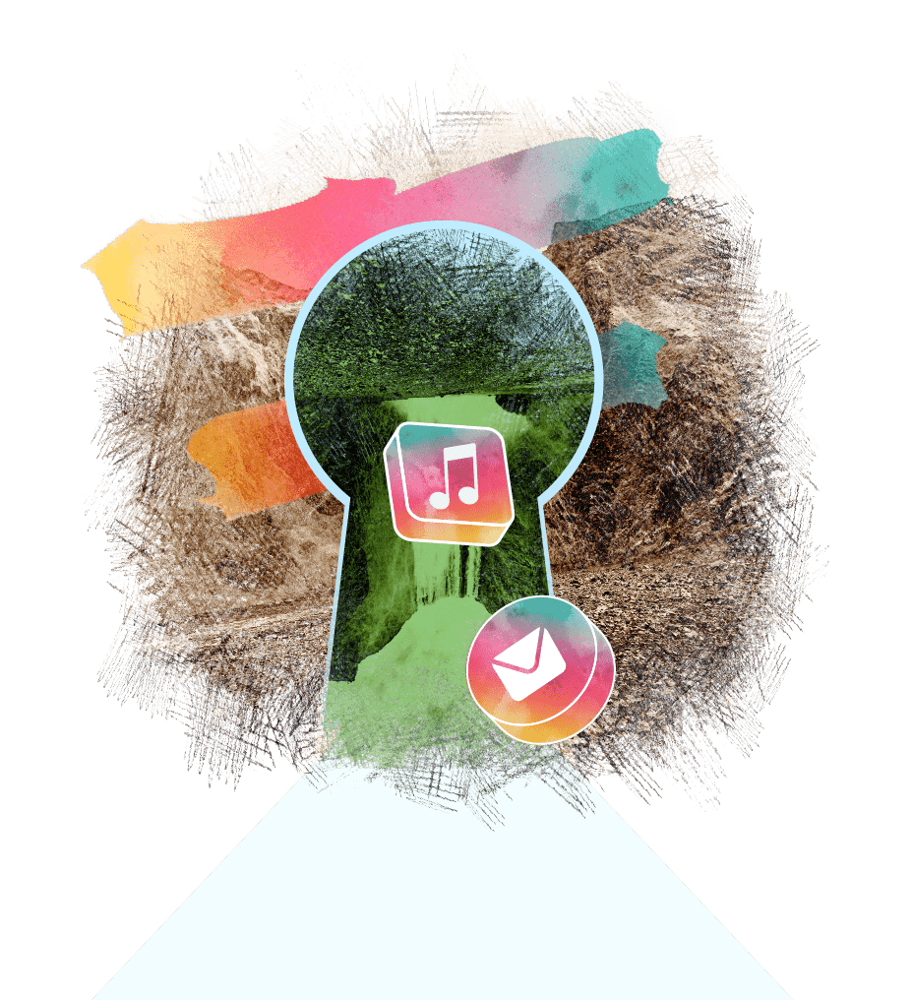

<!-- section 1 (header) -->



 

 

# EXPERIENCE THE   **FREEFLOW LIFE**

### **Become the center of your**   **own digital world.**

*___________________*

 

The FreeFlow experience puts you and your entire society at the healm of your digital lives. 

Control every aspect of your online presence.

<button>[SEE THE ECOSYSTEM]("/ecosystem")</button>

|||



<!-- section 2 (FF LIFE) -->



|||

## WHAT IS THE   **FREEFLOW LIFE?**

* A life where your internet is sovereign and it is owned by everyone.
* A life where every member of society has the opportunity to learn, partake and succeed. 
* A life where there is unlimited access to the tools required for progress. 
* A life where online privacy and security are no longer a concern. 
* A life where our usage of the Internet is not a burden to our planet. 



<!-- section 3 (ECOSYSTEM) -->



## FORMED BY   **ALL OF US**

FreeFlow exists due to a vast grid formed by Farmers, independent people that connect FreeFlow Nodes in any location that electricity and network are present. 

Together, they form a globally distributed Internet infrastructure and earn income in the form of CHI, the currency of the FreeFlow ecosystem. 

<button>[SEE THE ECOSYSTEM]("/ecosystem")</button>

|||



<!-- section 4 (DISCOVER) -->



|||

## **FLOW**   FREELY {#text-8xl}

### **with the FreeFlow Twin.**

The FreeFlow Twin allows you access to numerous decentralized annlicatinns built for the FreeFlow ecosystem. 

Communicate, network and collaborate with anyone without worrying about data breaches and identiy theft. Experience the feeling of freedom. 

<button>[DISCOVER]("/discover")</button>



<!-- section 5 (BENEFITS) -->



## RIDICULOUSLY   **GREEN.**

A typical FreeFlow user consumes less than five watts to access their entire digital life. This ul-tra-sustainable approach allows the system to easily scale without being a burden to the planet. 

<button>[SEE ALL BENEFITS]("/benefits")</button>

|||



<!-- section 6 (BLOGS) -->



## FREEFLOW   **BLOGS**

Stay Updated with everything ThreeFold.





### FREEFLOW KEY   **BLOG**

|||

### TOKENOMICS   **BLOG**

|||

### CHI   **BLOG**



<!-- section 6 (HOW IT WORKS) -->



## ACCESS IT ALL WITH   **THE FREEFLOW KEY**

Lorem ipsum dolor sit amet, consectetur adipisc-ing elit, sed do eiusmod tempor incididunt ut . . labore et dolore magna aliqua. 

<button>[HOW IT WORKS]("/howitworks")</button>

|||


