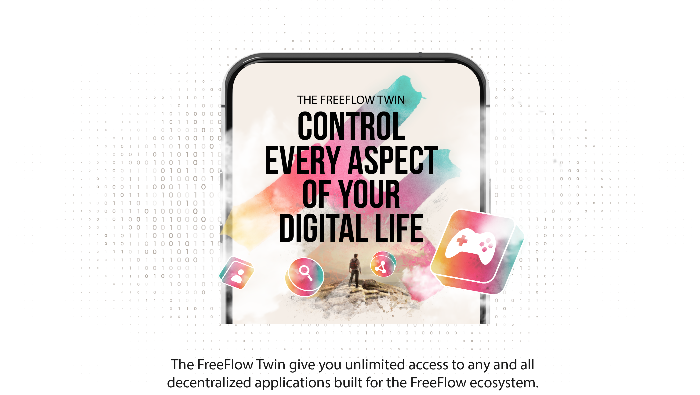
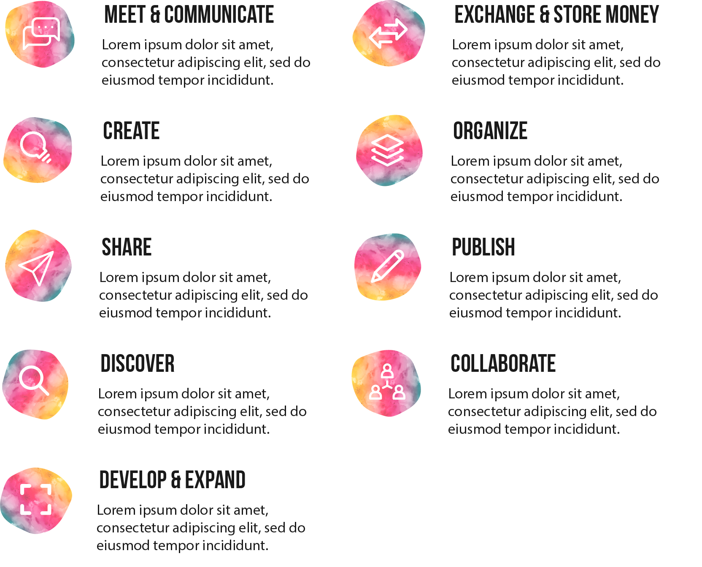

<!-- section 1 (heade FF TWIN) -->



<button>[GET THE TWIN]("/twin")</button>





|||

## NFT BASED   AUTHENTICATION

Your digital identity is an NFT known as the FreeFlow Key.

This ultra-secure and unique attribute allows you to stay completely safe while accessing all the different functions offered via the FreeFlow Twin.



<!-- section 3 (oldnew) -->



## DO ANYTHING.   DO EVERYTHING.

Your FreeFlow Twin comes with endless skills and capabilities.









|||

## FREE FLOWING   EXPERIENCES

Communicate, network and collaborate with anyone without worrying about data breaches and identiy theft.  Experience the feeling of freedom.

<button>[THE EXPERIENCES]("/experiences")</button>





## THIS IS WHERE   DATA COMES   TOGETHER

All of your data is always dispersed into different servers on the FreeFlow Grid.

Your FreeFlow Twin is the only place where your dispersed data is reassemled.

This model completely alliviates the concerns of the centralized data center model.

<button>[COMPARE MODELS]("/")</button>

|||





## RIDICULOUSLY   GREEN.

A typical FreeFlow user consumes less than five watts to access their entire digital life. 

This ultra-sustainable approach allows the system to easily scale without being a burden to the planet. 

|||









|||

Become the center of your digital life and experience complete control. Get your FreeFlow key now!

<button>[GET THE TWIN]("/")</button>

|||

