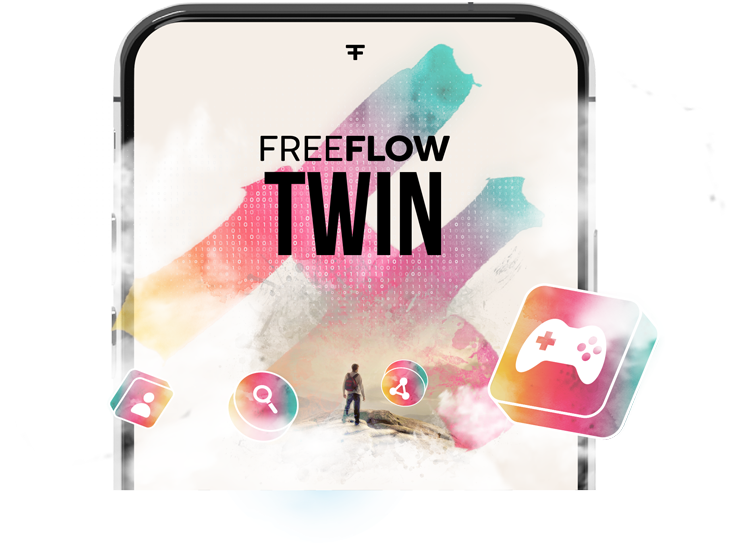

<!-- section 1 (heade FF TWIN) -->



 

### THE FREEFLOW TWIN

## control every   aspect of your   digital life

The FreeFlow Twin is your new digital identity.

<button>[KNOW MORE](/twin/#identity)</button>
<button onclick="window.open('https://threefoldfoundation.github.io/books/freeflow/network/buy/buy_my_twin.html', '_blank')">GET THE TWIN</button>

|||

 

 

 



<!-- section 2  -->



|||

### **THE FREEFLOW KEY**

## NFT BASED   AUTHENTICATION

Your Twin is accessed through a unique NTF Know as the FreeFlow Key, an ultra-secure and unique attribute allows you to stay completely safe and private.
<button class="flex mx-auto" onclick="window.open('https://threefoldfoundation.github.io/books/freeflow/network/tokens/ffk.html', '_blank')">MORE INFO</button>



<!-- section 3 (oldnew) -->



## DO ANYTHING.   DO EVERYTHING.

Your FreeFlow Twin comes with endless skills and capabilities.









|||

## FREE FLOWING   EXPERIENCES

Communicate, network and collaborate with anyone without worrying about data breaches and identiy theft.  Experience the feeling of freedom.

<button>[THE EXPERIENCES](/experiences)</button>





## THIS IS WHERE   DATA COMES   TOGETHER

All of your data is always dispersed into different servers on the FreeFlow Grid.

Your FreeFlow Twin is the only place where your dispersed data is reassemled.

This model completely alliviates the concerns of the centralized data center model.

<button onclick="window.open('https://threefoldfoundation.github.io/books/freeflow/mytwin/intro/twin_architecture.html', '_blank')">ARCHITECTURE</button>

|||





## RIDICULOUSLY   GREEN.

A typical FreeFlow user consumes less than five watts to access their entire digital life. 

This ultra-sustainable approach allows the system to easily scale without being a burden to the planet. 

|||





|||

## OWN YOUR   DIGITAL LIFE

Become the center of your digital life and   experience complete control.  Get your FreeFlow key now!

<button onclick="window.open('https://threefoldfoundation.github.io/books/freeflow/network/buy/buy_my_twin.html', '_blank')">GET THE TWIN</button>

